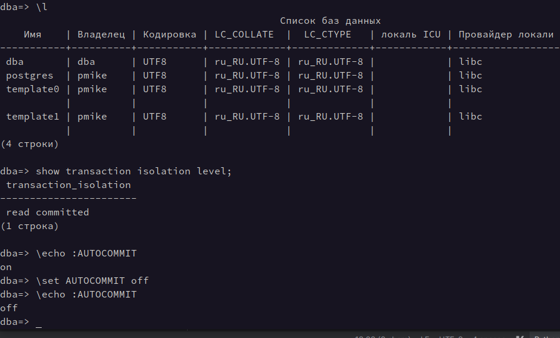
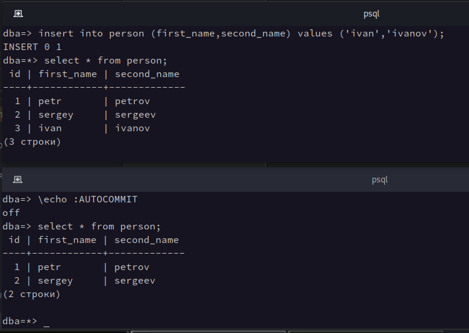
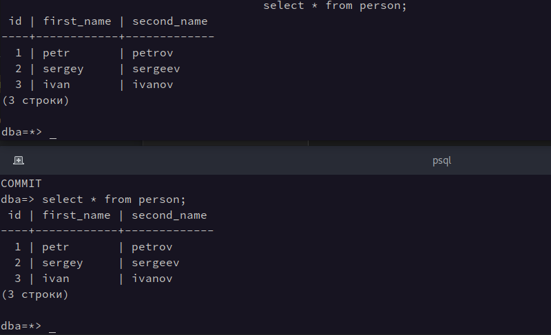
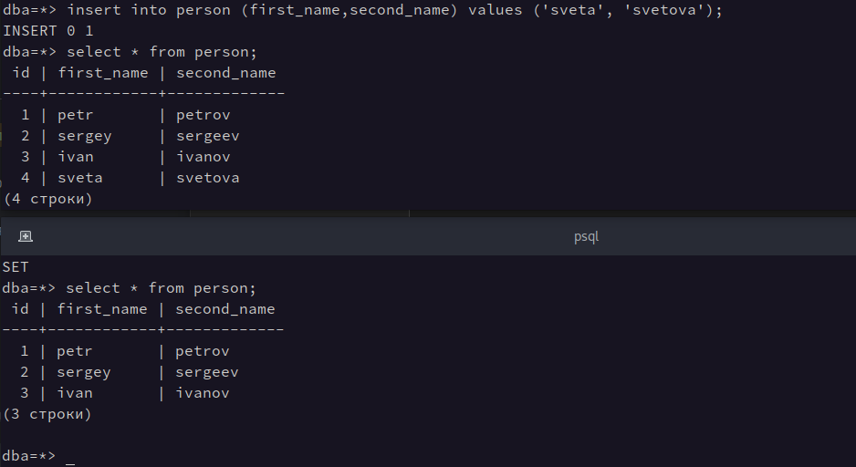
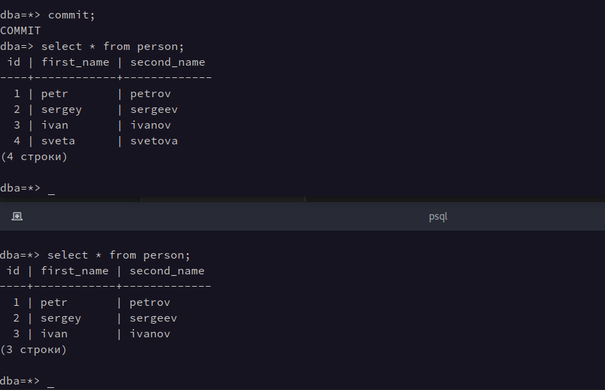
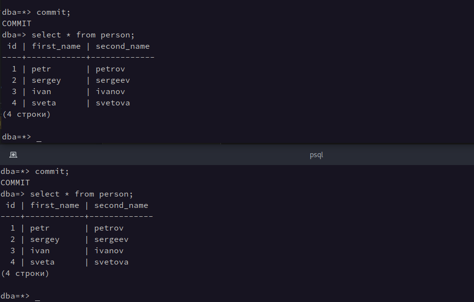

## Работа с уровнями изоляции транзакций в PostgreSQL

### Read committed

`````` sql
\set AUTOCOMMIT off
SET TRANSACTION ISOLATION LEVEL READ COMMITTED;
BEGIN;
``````



В первой сессии создаем запись в БД. В этой сессии изменения будут видны.
При этом во второй сессии этой записи не видно, до тех пор, пока транзакция первой сессии не будет завершена. Это 
обуславливается уровнем изоляции `Read committed`, который позволяет видеть зафиксированные изменения при перечитке 
данных в параллельных транзакциях до их завершения.



Коммит транзакции в первой сессии:



## Repeatable read

`````` sql
\set AUTOCOMMIT off
SET TRANSACTION ISOLATION LEVEL REPEATABLE READ;
BEGIN;
``````

В первой сессии создаем запись в БД. В этой сессии изменения будут видны. Во второй сессии новая запись видна не 
будет, как и при уровне `Read committed`.



После завершения транзакции в первой сессии, результаты изменений во второй сессии до сих пор не видны, в отличие от 
уровня `Read committed`. 



Данные, добавленные в первой сессии, будут видны во второй только после завершения 
транзакции второй сессии. Это обуславливается уровнем изоляции `Repeatable read`, который является более строгим по 
отношению к предыдущему уровню. 




