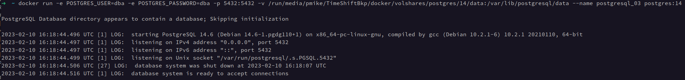

## 2. Установка и настройка PostgteSQL в контейнере Docker

1. Загрузим образ `postgresql` v14 из хаба:

```shell
docker pull postgres:14
```


2. Запускаем экземпляр БД:

```shell
docker run -e POSTGRES_USER=dba -e POSTGRES_PASSWORD=dba -p 5432:5432 -v /data:/run/media/pmike/TimeShiftBkp/docker/volshares/postgres/14 --name postgresql postgres:14
```

[Процесс запуска БД (png)](files/step_02.png)

3. Подключаемся к БД через докер:

```shell
docker exec -i -t 36a58d57b5a8 /bin/bash
```


4. Создаем тестовую таблицу `users`:


5. Тест подключения "извне" с запросом данных:


6. Удаляем контейнер:


7. Создаем контейнер БД заново...

_!! Ввиду указания неверных параметров запуска докера (volume), данные БД не сохранились. Повторив шаги с создания 
контейнера и убедившись, что в указанной папке на ПК появилась структура папок postgres'a и данные удаляем контейнер 
и создаем заново.._

- запуск контейнера:

```shell
docker run -e POSTGRES_USER=dba -e POSTGRES_PASSWORD=dba -p 5432:5432 -v /run/media/pmike/TimeShiftBkp/docker/volshares/postgres/14/data:/var/lib/postgresql/data --name postgresql_02 postgres:14

```

- подключение к БД и создание таблицы:


- удаляем контейнер:

```shell
docker stop postgresql_02 && docker rm postgresql_02
```

8. Запускаем контейнер в третий раз под именем `postgresql_03`:

```shell
docker run -e POSTGRES_USER=dba -e POSTGRES_PASSWORD=dba -p 5432:5432 -v /run/media/pmike/TimeShiftBkp/docker/volshares/postgres/14/data:/var/lib/postgresql/data --name postgresql_03 postgres:14
```

Сервер выдает сообщение о существовании директории с данными и пропуске первичной инициализации:



9. Делаем тестовое подключение к БД:


Данные на месте!
